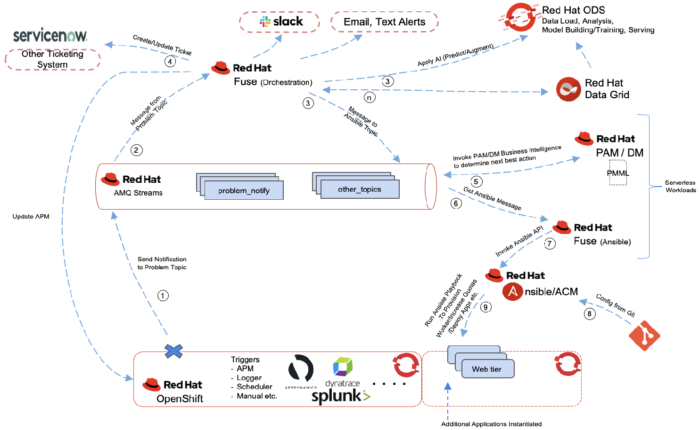
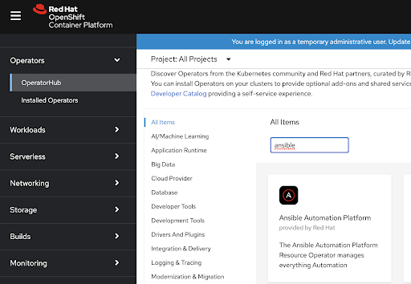
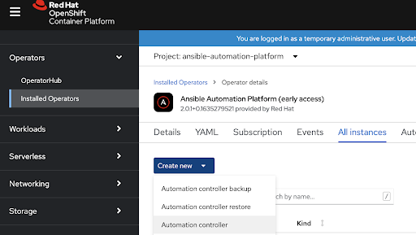
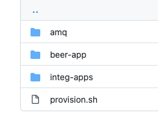
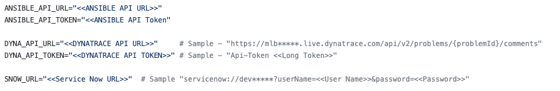
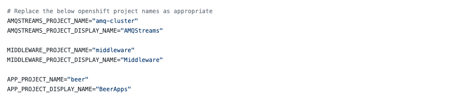

<h1>Self Healing and Remediation - Closed Loop Automation Blueprint</h1>

<p>Table of Contents</p>

<ul>
	<li><a href="#_intro">Introduction</a></li>
	<li><a href="#_prerequisites">Prerequisites</a></li>
	<li><a href="#_architecture">Architecture</a></li>
	<li><a href="#_installansible">Install Ansible Automation</a></li>
	<li><a href="#_installdynatrace">Install Dynatrace Operator</a></li>
	<li><a href="#_run">Install Middleware Services and Application</a></li>
</ul>

<h2 id="_intro">Introduction</h2>

<p>The rise in popularity of cloud-native and microservices-based architecture has introduced additional challenges and complexity. While these architectures offer benefits such as agility, scalability, and upgradability, they also increase the number of components that must be deployed and monitored, leading to greater complexity. The explosion of data from multiple microservices makes root cause analysis and troubleshooting more difficult.

As a result of this shift toward cloud-native, multi-cloud, and microservices-based architecture, there is a growing demand to simplify operational complexity arising from the use of multiple layers of technology. Closed-loop automation systems offer a solution by using AI-driven automation to detect anomalies, determine resolutions, and implement necessary changes within a highly automated framework. By addressing problems before they escalate, closed-loop automation helps to prevent issues.

The following architecture illustrates various products and the overall framework that can be employed to achieve self-healing using closed-loop automation.</p>

<h2 id="_prerequisites">Prerequisites</h2>

<ul>
	<li>Red Hat OpenShift Container Platform (Pre Istalled)</li>
	<li>Dynatrace Account (Existing)</li>
	<li>Dynatrace Configured on Red Hat OpenShift Container Platform</li>
	<li>JDK 1.8</li>
	<li>Service Now Account (Existing)</li>
	<li>Service Now URL</li>
	<li>Red Hat Ansible Install</li>
	<li>Access to Ansible API URL and API Token</li>
	<li>Dynatrace API URL and API Token</li>
</ul>

<h2 id="_architecture">Architecture</h2>

<p style="text-align:center;"></p>
<p align=center>Figure 1</p>
<p>As shown in Figure 1, the proposed solution assumes a workload (example: 5G core network function, RAN vCU, etc.) running on a Kubernetes-based platform like Red Hat OpenShift, in a hybrid cloud environment. The workload can consist of multiple microservices that need to be monitored.&nbsp;<br />
As you can see we opted to leverage Dynatrace as the observability platform to monitor our workload. Dynatrace integrates nicely with OpenShift using the Operator Framework so its deployment is simple and scalable as we will describe below. However any other APM, monitoring or logging framework can be leveraged.</p>

<h2  id="_installansible">Install Ansible Automation</h2>
<p>In the OpenShift console, login to Operator Hub and search for Ansible Automation Platform</p>
<p style="text-align:center;"></p>
<p>Install the Operator by choosing the default options. Once the operator is deployed, deploy the automation controller (Under Installed Operators, find the Operator then create the automation controller - see below). You can give it any name (example “controller”).</p>
<p style="text-align:center;"></p>
<p>In order to get the admin password for the UI, use the following command in the OpenShift CLI: oc get secret controller-admin-password -o jsonpath="{.data.password}" | base64 --decode

To login to the Ansible UI, in your OpenShift dashboard, find the Ansible controller route under “Routes”, login and use the admin credentials (password from command above) to login.</p>

<h2  id="_installdynatrace">Install Dynatrace Operator</h2>
<p>After you sign up for a Dynatrace account (dynatrace.com), you will need to retrieve your apiToken and paasToken. Install the Dynatrace Operator from the Operator Hub (use namespace “dynatrace”)

Once you have the tokens, create a secret called “dynakube” in OCP using this command:</p>
```
oc -n dynatrace create secret generic dynakube --from-literal="apiToken=dt0c01.Q7J5AV6ZWVXX57LWWBYUL3EQ.NWTFX7LIW2VUM55A7SKBQLAYHFIGRUB7M5E3UTDZNCRLFV36OUNAJ4IBHJCAMBE5" --from-literal="paasToken=dt0c01.PSGJATLU52VT4RC6N7JAZGRP.RVXZ3G2HBFU3VVIL4I6U6QXM22JRNJJEZ33L226RLX7KJAB44GA6ORGCTQWLIAAV"
```
<p>
Now go to the Operator UI and create a DynaKube instance using the environment URL and secret you just created.

Then go to your Dynatrace dashboard https://<envID>.live.dynatrace.com/
Go to Settings> Cloud and Virtualization -> Kubernetes -> Connect new cluster
In the form, enter your api URL and Bearer Token. Even if your cluster is airgapped/disconnected, this is still feasible (for example, URL can be https://192.168.116.107:6443). To get the bearer token, run this command:</p>
```
oc get secret $(oc get sa dynatrace-kubernetes-monitoring -o jsonpath='{.secrets[0].name}' -n dynatrace) -o jsonpath='{.data.token}' -n dynatrace | base64 --decode
```
or
```
oc get secret $(oc get sa dynatrace-kubernetes-monitoring -o jsonpath='{.secrets[1].name}' -n dynatrace) -o jsonpath='{.data.token}' -n dynatrace | base64 --decode
```
<p>depending on your OCP cluster.</p>

In Dynatrace dashboard, go to Settings -> Integration-> Problem Notifications> Add a notification
Webhook URL: http://my-bridge-route-amq.apps.ocp-rony.openshiftcorpredhat.com/topics/dynatrace-prob-notify

Custom Payload:
```
{
    "records": [
        {
            "value": {
                "State": "{State}",
                "ProblemID": "{ProblemID}",
                "ProblemTitle": "{ProblemTitle}",
                "ProblemDetailsMarkdown": "{ProblemDetailsMarkdown}",
                "ProblemDetailsJSON": {ProblemDetailsJSON},
                "ProblemImpact": "{ProblemImpact}",
                "ProblemSeverity": "{ProblemSeverity}",
               "ProblemURL": "{ProblemURL}",
               "Tags": "{Tags}",
                "ImpactedEntities": {ImpactedEntities}
            }
        }
    ]
}
```
Run the following command and extract the certificate:
```
oc get kafka -o yaml 
```
    
In the Dynatrace dashboard, create a synthetic monitor using:
Monitor -> Synthetic -> Create a synthetic monitor -> Create an HTTP monitor
Name: BEER-Service-HTTP-Monitor
URL: https://beer-native-beer.apps.openshift.dfw.ocp.run/ (substitute with your URL)
Monitor every 1 minute (from location: Texas.. you can select more) 

<h2  id="_run">Install Middleware Services and Application</h2>

```
git clone https://github.com/ocp-run/selfhealinginfra
```

<ol>
	<li>Directory Structure
	<p style="text-align:center;"></p>
	<ul>
	  <li>At the root you have the provision.sh, this is the main file for installing and configuring the demo on OpenShift Container Platform</li>
	  <li>amq folder - contains scripts for installing and configuring the AMQ Cluster and setting up the topics</li>
	  <li>integ-apps - contains yaml files for installing and configuring the applications for providing the integration applications</li>
	  <li>beer-app - contains yaml files for setting the test application which will provide the rest endpoint for testing</li>
	</ul>
	</li>
	<li>Editing the provision.sh
	<ul>
		<li>Open the provision.sh in any text editor</li>
		<li>At the top there are a few variable for which you need to provide appropriate values
		<p></p>
		<ul>
			<li>ANSIBLE_API_URL - Ansible Tower API URL</li>
			<li>ANSIBLE_API_TOKEN - Ansible API Token</li>
			<li>DYNA_API_URL - Dynatrace API URL</li>
			<li>DYNA_API_TOKEN - Dynatrace API Token</li>
			<li>SNOW_URL - Service Now URL</li>
		</ul>
		</li>
	</ul>
	</li>
	<li>Next section contains the names of the various projects for AMQ, Integration Applications and the Test application replace as appropriate
	<p style="text-align:center;"></p>
	<ul>
		<li>AMQSTREAMS_PROJECT_NAME - Project Name for installing &amp; Configuring&nbsp;the AMQ Cluster</li>
		<li>AMQSTREAMS_PROJECT_DISPLAY_NAME - Project Description for the AMQ Cluster (no spaces)</li>
		<li>MIDDLEWARE_PROJECT_NAME - Project Name for installing &amp; Configuring&nbsp;the Middleware Applications</li>
		<li>MIDDLEWARE_PROJECT_DISPLAY_NAME - Project Description for the Middleware Applications</li>
		<li>APP_PROJECT_NAME - Project Name for installing &amp; Configuring&nbsp;the Test Applications</li>
		<li>APP_PROJECT_DISPLAY_NAME -&nbsp;Project Description for the Test Applications</li>
	</ul>
	</li>
</ol>

```
cd mw-apps
./provision.sh
```


Run the load test and verify the closed loop.
Next step is to validate if the infracture will scale itsself based on the load or in case of a missing route.
Here is a sample load test you can run (using the hey tool):
```
#!/bin/sh
for i in {1..8}
do
    requests=$((100+50*i));echo "output: iteration $i";
    ./hey -c $requests -q 1 -z 30s -m GET <app_URL>
done
#run at constant high load for 10 minutes
./hey -c 500 -q 1 -z 10m -m GET <app_URL>
```
